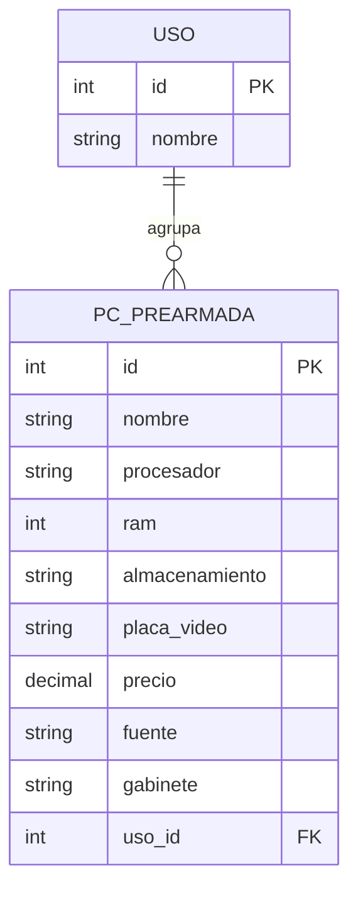

# Historial del Trabajo Práctico — Tecnologías Web (TUARI/UNICEN)

> Bitácora de trabajo del TP "PC Prearmadas" (backend NestJS + frontend Angular).
> Registra, por cada paso: objetivo, concepto de cátedra aplicado, decisiones tomadas
> y los checkpoints de comprensión respondidos por el/la estudiante.
> Este documento se entrega junto con el TP como parte de la evaluación.

## Datos generales

- **Materia:** Tecnologías Web (TUARI/UNICEN)
- **Proyecto:** API "PC Prearmadas" — PCs agrupadas por tipo de uso
- **Repositorio backend:** https://github.com/titiyo/TecnologiasWeb (branch `main`)
- **Repositorio frontend:** (a crear, separado del backend)
- **Stack 1ra entrega:** NestJS + TypeORM + PostgreSQL, colección Postman
- **Stack 2da entrega:** Angular + deploy (Render / Netlify)

## Consigna (resumen)

**Primera entrega — Backend (NestJS) + Postman**
- Dos entidades con relación 1 a N.
- CRUD completo (crear, editar, eliminar, listar) + filtrar el listado por al menos un campo.
- Persistencia con base relacional (PostgreSQL) vía TypeORM.
- Colección de Postman con todos los casos de uso, subida al repo.
- Buenas prácticas: módulos/controladores/servicios, validaciones, manejo de errores y
  códigos de estado HTTP correctos.

**Segunda entrega — Frontend (Angular) + Deploy**
- CRUD completo desde la UI mostrando las entidades y su relación, responsive.
- Consumir exclusivamente los endpoints de la primera entrega.
- Deploy: backend en Render, frontend en Netlify.

## Modelo de datos (relación 1 a N)

- **Uso (1) → PcPrearmada (N):** un uso (ej. "Gaming") agrupa muchas PCs.
- **Uso:** `id`, `nombre`
- **PcPrearmada:** `id`, `nombre`, `procesador`, `ram` (int, GB), `almacenamiento` (string),
  `placa_video` (opcional), `precio` (decimal), `fuente`, `gabinete`, `uso_id` (FK → Uso.id)

## Decisiones tomadas (acordadas)

- Base de datos: **PostgreSQL** (driver `pg`), `docker-compose` con **postgres + adminer**.
- Conexión **hardcodeada** en `app.module.ts` (sin `.env` ni `@nestjs/config`). *(Ver pendiente.)*
- Validaciones **manuales** (sin `class-validator`): `ConflictException` para duplicados y
  nombre vacío; `NotFoundException` para "no encontrado".
- Puerto **3000**.
- Progresión: primero CRUD **en memoria**, después migrar a **TypeORM/Postgres**.
- **Dos repos separados** (backend y frontend), no monorepo.
- Convenciones TypeORM: `@PrimaryGeneratedColumn`, `@Column`, `@Column('decimal')` para
  `precio`, propiedades con `!`; relación `@ManyToOne`/`@OneToMany` + `@JoinColumn({ name: 'uso_id' })`.
- En TS/JSON se usa camelCase (`usoId`, `placaVideo`); la columna en la base es `uso_id`.

### Pendientes / a revisar antes de la entrega

- [ ] **Conflicto:** la consigna pide "conexión por variables de entorno", pero se decidió
      hardcodear. Revisar y resolver antes de entregar.
- [ ] Filtrar el listado por uso: `GET /pc-prearmadas?usoId=X`.
- [ ] Subir la colección de Postman al repo.
- [ ] README.
- [ ] Crear el repo separado del frontend Angular.

---

## Bitácora de pasos

### Paso 1 — Scaffold NestJS (hecho)

- **Objetivo:** crear la estructura base del proyecto con `nest new`.
- **Concepto:** NestJS es un framework Node.js server-side, TypeScript-first, que da
  estructura por módulos. El `AppModule` es el *root module*, punto de entrada de la app.
- **Resultado:** proyecto NestJS generado, `.gitignore`, scripts de npm.

### Paso 2 — Módulo `Uso` en memoria + DTOs (hecho)

- **Objetivo:** primer CRUD, sin base de datos.
- **Concepto (cátedra):** separación MVC — el `Controller` recibe/valida los pedidos HTTP y
  delega en el `Service` (provider) la lógica; el `Service` guarda los datos. Un módulo por
  feature (`UsosModule`), con todo lo relacionado adentro. DTO = clase que define la forma de
  los datos que entran/salen; convención: **un DTO por operación** (`CreateUsoDto`, `UpdateUsoDto`).
- **Resultado:**
  - `Uso` como clase plana (constructor `id`, `nombre`).
  - `UsosService` con array privado semilla `[Gaming, Oficina, Doméstico, Estudio]`.
  - `UsosController` con `POST` (chequeo de duplicado → `ConflictException`), `GET`, `GET/:id`,
    `PATCH/:id`, `DELETE/:id`.
  - `findOne`/`update` quedaron como *placeholders*.
  - `AppModule` importa `UsosModule`.

### Paso 3 — `findOne`/`update` + validación de nombre en el PATCH (hecho)

- **Objetivo:** completar el CRUD de `Uso` en memoria y validar el nombre en el `PATCH`.
- **Conceptos aplicados:**
  - `find` sobre el array + `NotFoundException` si no aparece (misma excepción que en `remove`).
  - En JS los objetos se pasan **por referencia**: `findOne` devuelve el mismo objeto del array,
    así que modificar sus propiedades impacta directamente sin reubicarlo.
  - `PartialType` en `UpdateUsoDto`: el body del `PATCH` es parcial (los campos pueden faltar).
  - Códigos de estado: `409 Conflict` para nombre vacío/duplicado (decisión del grupo, por
    consistencia con el `POST`), `404 Not Found` para recurso inexistente.
- **Implementación:**
  - `UsosService.findOne(id)`: `find` + `NotFoundException`.
  - `UsosService.update(id, dto)`: reusa `findOne` y aplica cambios si `nombre` viene definido.
  - `UsosController.update`: si `nombre` viene vacío/espacios → `ConflictException`; si viene
    duplicado en **otro** uso → `ConflictException` (excluyendo el propio `id`). `{}` → 200.
- **Commit:** `Implement Uso findOne/update and validate nombre in PATCH`

**Checkpoint respondido por el/la estudiante:**

> "Al llamar a `this.findOne(id)`, si el id no existe la propia función `findOne` ejecuta su
> `throw new NotFoundException` y corta la ejecución ahí mismo. El resto del código de `update`
> ni siquiera llega a correr si el elemento no fue encontrado. Además, como en JavaScript los
> objetos se manejan por referencia en memoria, `findOne` devuelve el mismo objeto que está
> dentro del array, por lo que aplicarle los cambios impacta de forma directa sin tener que
> volver a buscar su posición."

> "Si el nombre no viene (`undefined`), en un PATCH se entiende que el cliente no quiere tocar
> ese campo. En cambio, si el nombre viene vacío (`""` o solo espacios), el cliente envió el
> campo explícitamente pero con un valor inválido para la regla de negocio, por lo que debe
> rechazarse."

> "Dejar el PATCH con body vacío `{}` devolviendo 200 sin cambios es la convención habitual en
> APIs REST, porque aplicar cero modificaciones sobre un recurso existente no rompe el estado y
> resulta idempotente. Para el cambio de nombre, sí corresponde devolver 409 Conflict si se
> intenta renombrar a un nombre que ya pertenece a otro uso, asegurándote en la comparación de
> que el id del uso existente sea distinto al id que estás editando."

### Paso 4 — Entidad `PcPrearmada` + DTOs (hecho)

- **Objetivo:** modelar la segunda entidad (el lado N de la relación) con sus DTOs, todavía sin
  base de datos.
- **Decisiones tomadas:**
  - `almacenamiento` → **string** (ej. `"1TB SSD"`).
  - `placa_video` → **opcional, sin default** (`placaVideo?: string`).
  - FK representada como `usoId: number` (plana) por ahora; en TypeORM pasa a relación `uso`.
- **Resultado:**
  - `src/pc-prearmadas/entities/pc-prearmada.entity.ts` (clase plana, sin decoradores aún).
  - `src/pc-prearmadas/dto/create-pc-prearmada.dto.ts` (`placaVideo?` opcional).
  - `src/pc-prearmadas/dto/update-pc-prearmada.dto.ts` (`extends PartialType(CreatePcPrearmadaDto)`).

**Checkpoint respondido por el/la estudiante:**

> "`PartialType` crea el tipo para PATCH clonando `CreatePcPrearmadaDto` y volviendo todos sus
> campos opcionales en TypeScript, ahorrándote definir otro DTO manual idéntico. `placaVideo?` es
> el único opcional porque una PC puede armarse solo con video integrado del procesador; el resto
> (RAM, disco, fuente, gabinete, uso, etc.) son obligatorios para que el equipo exista."

### Paso 5 — `docker-compose` (Postgres + Adminer) (hecho)

- **Objetivo:** levantar la base relacional y una herramienta de administración en local.
- **Concepto (cátedra):** antes de persistir con un ORM se prepara **docker + postgres**. El ORM
  (TypeORM) convierte datos entre el sistema de tipos de objetos y la base relacional; el
  *DB connector* (`pg`) es quien ejecuta el SQL sobre la conexión.
- **Config elegida:** usuario `postgres`, password `secret123!`, base `pc_prearmadas`;
  Postgres en `5432` y Adminer en `8080`.
- **Resultado:** `docker-compose.yml` con los servicios `postgres` (`postgres:16-alpine`) y
  `adminer`.
- **Nota:** el volumen de datos `data/` y el ajuste de `.gitignore` se agregan en el paso 7.

### Paso 6 — TypeORM/Postgres para `Uso` (hecho)

- **Objetivo:** reemplazar el array en memoria por persistencia real en PostgreSQL.
- **Conceptos aplicados (cátedra):**
  - **ORM:** convierte datos entre el sistema de tipos de objetos y la base relacional. En NestJS
    se usa **TypeORM**.
  - **Entity:** clase decorada con `@Entity()`; `@PrimaryGeneratedColumn()` para el `id` y
    `@Column()` para los campos.
  - **Repository Pattern:** el service ya no habla con el array sino con un `Repository<Uso>`,
    inyectado con `@InjectRepository(Uso)`. Esto da independencia del origen de datos.
  - **Módulo:** `TypeOrmModule.forFeature([Uso])` registra el repositorio de esa entidad.
  - **Conexión:** `TypeOrmModule.forRoot({...})` en `AppModule`, con la conexión **hardcodeada**
    (host `localhost`, puerto `5432`, user `postgres`, password `secret123!`, db `pc_prearmadas`).
  - **`synchronize: true`:** TypeORM crea/actualiza las tablas a partir de las entidades.
  - **`autoLoadEntities: true`:** carga las entidades registradas vía `forFeature` (evita listarlas
    a mano en `forRoot`).
  - **`OnModuleInit`:** hook de ciclo de vida usado para **sembrar** los 4 usos si la tabla está vacía.
- **Nota de versiones:** `npm install` trajo por defecto `typeorm@1.x` / `@nestjs/typeorm@12` /
  `@nestjs/mapped-types@12`, que son **ESM-only** y rompían Jest. Se fijaron versiones alineadas a
  la cátedra (CommonJS): `typeorm@^0.3.31`, `@nestjs/typeorm@^11.0.3`, `@nestjs/mapped-types@^2.1.1`.
- **Cambios en el código:**
  - `src/usos/entities/uso.entity.ts`: ahora con decoradores (`@Entity`, `@PrimaryGeneratedColumn`, `@Column`).
  - `src/usos/usos.module.ts`: importa `TypeOrmModule.forFeature([Uso])`.
  - `src/usos/usos.service.ts`: usa `Repository<Uso>`; métodos **async**; `remove` con chequeo de
    `result.affected` (404 si 0) y respuesta `{ message, status: 'success' }`.
  - `src/app.module.ts`: `TypeOrmModule.forRoot(...)`.
  - Specs de `Usos` actualizados con mocks del repositorio/servicio para que sigan pasando.

**Checkpoint respondido por el/la estudiante:**

> "`async`/`await`: la base de datos es externa (corre en Docker/Postgres); las consultas toman
> tiempo y devuelven una `Promise`, por lo que se usa `async`/`await` para no congelar la
> aplicación mientras espera la respuesta. `TypeOrmModule.forFeature([Uso])`: registra la entidad
> `Uso` en ese módulo para crear y dejar listo su `Repository<Uso>` mediante inyección de
> dependencias."

### Paso 7 — Persistencia de datos del contenedor (hecho)

- **Objetivo:** que los datos de Postgres sobrevivan a reinicios del contenedor y no se versionen.
- **Cambios:** en `docker-compose.yml` se agregó el volumen `./data:/var/lib/postgresql/data`. El
  `.gitignore` ya incluía `data/`, así que la carpeta de datos no se sube al repo.
- **Concepto:** un *bind mount* conecta una carpeta del host con una del contenedor; al mapear el
  directorio de datos de Postgres, la información persiste entre `down`/`up`.

### Paso 8 — `PcPrearmada` service/controller con Postgres (relación 1:N) (hecho)

- **Objetivo:** implementar el CRUD de la segunda entidad, ya en Postgres, con su relación con `Uso`.
- **Conceptos aplicados (cátedra):**
  - **Relación 1:N:** en `PcPrearmada`, `@ManyToOne(() => Uso, (uso) => uso.pcPrearmadas)` +
    `@JoinColumn({ name: 'uso_id' })`; en `Uso`, `@OneToMany(() => PcPrearmada, (pc) => pc.uso)`.
    El `@JoinColumn` deja la FK en la tabla de PCs con la columna `uso_id`.
  - **`relations`:** al leer (`find`/`findOne`) se carga la relación con `relations: { uso: true }`,
    así la respuesta incluye el objeto `uso` y no solo la FK.
  - **Comunicación entre módulos:** `UsosModule` **exporta** `UsosService`, y `PcPrearmadasModule`
    lo **importa**, para inyectarlo (Inyección de Dependencias) y validar que el uso exista.
  - **Validación de la relación:** al crear/actualizar, se llama a `usosService.findOne(usoId)`;
    si no existe, ese método ya lanza `NotFoundException` (404).
  - **`autoLoadEntities`:** al registrar `PcPrearmada` con `forFeature`, TypeORM la carga sola.
- **Cambios en el código:**
  - `src/pc-prearmadas/entities/pc-prearmada.entity.ts`: entidad con decoradores y relación.
  - `src/usos/entities/uso.entity.ts`: se agregó el lado `@OneToMany`.
  - `src/pc-prearmadas/pc-prearmadas.module.ts`, `.service.ts`, `.controller.ts`.
  - `src/usos/usos.module.ts`: `exports: [UsosService]`.
  - `src/app.module.ts`: importa `PcPrearmadasModule`.
- **Decisiones/notas:**
  - En `update` se usa "cargar (`findOne`) + modificar + `save`" en vez de `repository.update` con
    `result.affected`, porque con la relación el `save` es más seguro para reasignar la FK.
  - `remove` sí usa el chequeo de `result.affected` (404 si 0).
  - **Nota pendiente:** `precio` es `decimal`; Postgres lo devuelve como **string** (ej. `"1500.00"`).
    A revisar si conviene transformarlo a número para el frontend.
  - **Nota pendiente:** borrar un `Uso` que tiene PCs asociadas genera un error de FK; hoy no está
    manejado con un código lindo (a decidir más adelante).

**Checkpoint respondido por el/la estudiante:**

> "Lado de la FK: va en el lado N (`PcPrearmada`), porque cada PC tiene un único uso asociado. Si
> se pusiera en `Uso` (el 1), esa tabla tendría que almacenar una lista de IDs, violando las reglas
> de bases de datos relacionales. `uso: { id: usoId }` vs. objeto completo: pasando `{ id: usoId }`
> sólo le indicás a TypeORM el ID para armar la clave foránea en la consulta SQL. Enviar el objeto
> completo te obligaría a hacer una consulta previa (SELECT) para traerlo o correrías el riesgo de
> sobrescribir datos de la tabla `Uso` si estuviera configurado el guardado en cascada."

### Paso 9 — Filtro del listado por uso: `GET /pc-prearmadas?usoId=X` (hecho)

- **Objetivo:** cumplir el requisito de la consigna de **filtrar el listado por un campo**.
- **Concepto (cátedra):** el filtrado usa **Query Parameters** (`?dato=valor`); a diferencia de un
  Route Parameter (`/recurso/:id`), los query params **modifican el conjunto resultado** y no el
  recurso pedido. Se leen en Nest con `@Query()`.
- **Implementación:**
  - `PcPrearmadasController.findAll(@Query('usoId') usoId?: string)`: pasa `usoId ? +usoId : undefined`.
  - `PcPrearmadasService.findAll(usoId?)`: si viene `usoId`, filtra con `where: { uso: { id: usoId } }`
    (filtra por la FK de la relación); si no, devuelve todas. Siempre con `relations: { uso: true }`.
- **Ejemplo:** `GET /pc-prearmadas?usoId=1` devuelve solo las PCs del uso con id 1 (ej. "Gaming").

**Checkpoint respondido por el/la estudiante:**

> "Route param (`/usos/:id`): identifica un recurso único y concreto dentro de la jerarquía de la
> URL. Es parte obligatoria de la ruta: sin el ID, estás apuntando a otro endpoint distinto. Query
> param (`?usoId=1`): modifica o restringe el resultado de una colección sin cambiar el recurso al
> que le pegás; es opcional. Por qué query param para filtrar: la convención REST y la cátedra
> indican que un filtro altera el conjunto de datos devuelto (seguís pidiendo la colección
> `pc-prearmadas`), pero no define un recurso individual nuevo ni debe ensuciar la estructura de la
> ruta. Si no mandás el query param, simplemente recibís todas las PCs."

---

## Registro de commits

| Commit | Descripción |
|---|---|
| `c8874f9` | chore: reset repositorio |
| `346f1ee` | Initial commit: NestJS project scaffold |
| `3bcca5b` | Implement Uso module with CRUD operations and add necessary DTOs |
| (a completar) | Implement Uso findOne/update and validate nombre in PATCH |
| (a completar) | Add PcPrearmada entity and DTOs |
| (a completar) | Add docker-compose for Postgres and Adminer |
| (a completar) | Integrate TypeORM/Postgres for Uso |
| (a completar) | Persist Postgres data volume |
| (a completar) | Implement PcPrearmada CRUD with Postgres relation |
| (a completar) | Filter PcPrearmada listing by usoId |
