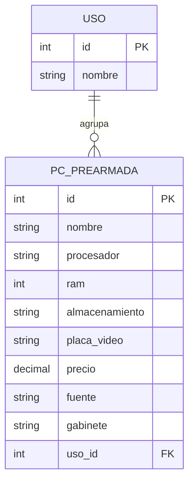

# PC Prearmadas — API (Backend)

Backend del TP de **Tecnologías Web** (TUARI/UNICEN). API REST en **NestJS** con persistencia en
**PostgreSQL** vía **TypeORM**, que administra PCs prearmadas agrupadas por tipo de uso.

- **Relación 1 a N:** `Uso` (1) → `PcPrearmada` (N).
- CRUD completo de ambas entidades + **filtrado** del listado de PCs por uso.
- Colección de Postman con todos los casos de uso incluida en `postman/`.

## Tecnologías

- NestJS + TypeScript
- TypeORM + PostgreSQL (`pg`)
- Docker / docker-compose (PostgreSQL + Adminer)

## Modelo de datos

**Uso**

| Campo  | Tipo   |
| ------ | ------ |
| id     | int PK |
| nombre | string |

**PcPrearmada**

| Campo          | Tipo            |
| -------------- | --------------- |
| id             | int PK          |
| nombre         | string          |
| procesador     | string          |
| ram            | int (GB)        |
| almacenamiento | string          |
| placa_video    | string (opcional) |
| precio         | decimal         |
| fuente         | string          |
| gabinete       | string          |
| uso_id         | int FK → Uso.id |



## Requisitos

- Node.js y npm
- Docker (para la base de datos)

## Puesta en marcha

```bash
# 1. instalar dependencias
npm install

# 2. levantar PostgreSQL + Adminer
docker compose up -d

# 3. levantar la API en modo desarrollo
npm run start:dev
```

La API queda en `http://localhost:3000`. Adminer (administrador de la DB) en `http://localhost:8080`.

Al iniciar, si la tabla de usos está vacía, se **siembran** 4 usos: Gaming, Oficina, Doméstico y Estudio.

## Variables de entorno

La conexión a la base se lee de variables de entorno, con valores por defecto para desarrollo local
(ver `.env.example`). Sin `@nestjs/config`, un archivo `.env` **no se carga automáticamente**; en
producción (Render) se configuran desde el panel del servicio.

| Variable    | Default        |
| ----------- | -------------- |
| DB_HOST     | localhost      |
| DB_PORT     | 5432           |
| DB_USERNAME | postgres       |
| DB_PASSWORD | secret123!     |
| DB_NAME     | pc_prearmadas  |
| PORT        | 3000           |

## Endpoints

### Usos

| Método | Ruta        | Descripción                          |
| ------ | ----------- | ------------------------------------ |
| GET    | `/usos`     | Listar usos                          |
| GET    | `/usos/:id` | Obtener un uso por id                |
| POST   | `/usos`     | Crear un uso (409 si ya existe)      |
| PATCH  | `/usos/:id` | Actualizar un uso (409 nombre vacío) |
| DELETE | `/usos/:id` | Eliminar un uso (409 si tiene PCs)   |

### PcPrearmadas

| Método | Ruta                      | Descripción                                    |
| ------ | ------------------------- | ---------------------------------------------- |
| GET    | `/pc-prearmadas`          | Listar PCs (con su uso embebido)               |
| GET    | `/pc-prearmadas?usoId=1`  | **Filtrar** las PCs por uso                    |
| GET    | `/pc-prearmadas/:id`      | Obtener una PC por id                          |
| POST   | `/pc-prearmadas`          | Crear una PC (404 si el uso no existe)         |
| PATCH  | `/pc-prearmadas/:id`      | Actualizar una PC (404 si el uso no existe)    |
| DELETE | `/pc-prearmadas/:id`      | Eliminar una PC                                |

## Colección de Postman

En [`postman/PC-Prearmadas.postman_collection.json`](postman/PC-Prearmadas.postman_collection.json),
con todos los casos de uso (incluidos los de error 404 / 409). Importarla en Postman y usar la
variable `baseUrl` (por defecto `http://localhost:3000`).

## Tests

```bash
npm run test
```

## Autor

_(completar)_ — Tecnologías Web, TUARI/UNICEN.
